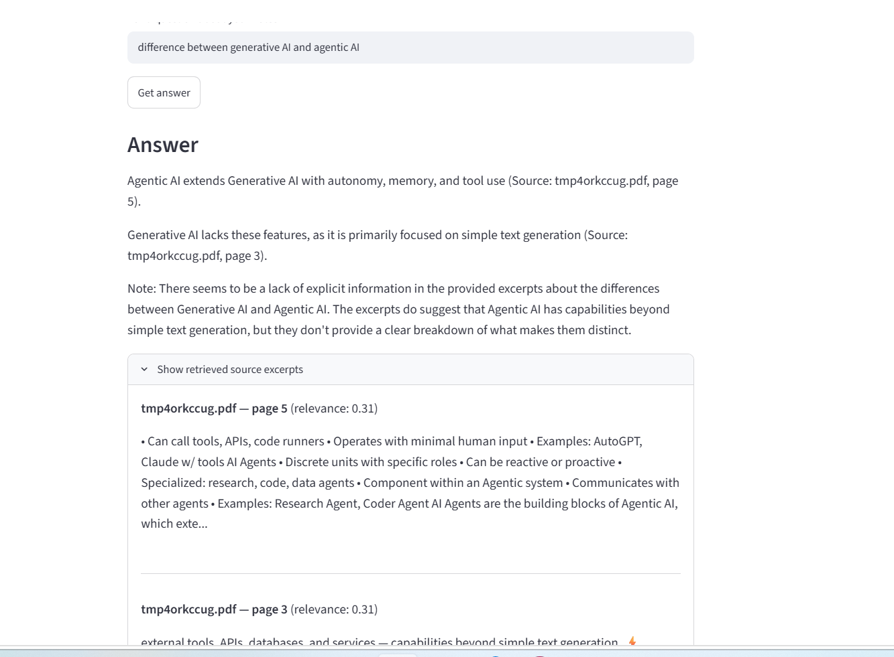

# 📚 StudyMate — RAG-Based Study Assistant

StudyMate lets you upload your own lecture notes (PDF) and ask questions in plain English. It retrieves the most relevant passages from your notes and generates an answer **grounded in your material only** — with every claim cited back to the exact source file and page number.

Built to solve a real problem: as an engineering student, I spend hours searching through dense lecture PDFs before exams. StudyMate turns that into a conversation.

## Why this project

This is an implementation of **Retrieval-Augmented Generation (RAG)** — the same architectural pattern used in production AI systems to ground LLM outputs in real data instead of relying on the model's memory alone. Rather than a full "smart" system, it's a deliberately simple, transparent RAG pipeline: every step (extraction, chunking, retrieval, generation) is visible and explainable end-to-end.

## How it works

```
PDF Lecture Notes
      │
      ▼
[1] Ingestion (src/ingest.py)
    Extract text per page → clean → split into overlapping chunks
    with page-level metadata attached to each chunk
      │
      ▼
[2] Retrieval (src/retriever.py)
    TF-IDF vectorization + cosine similarity
    → ranks chunks by relevance to the user's question
      │
      ▼
[3] Generation (src/qa.py)
    Top-k relevant chunks + question → Claude API
    → answer constrained to only use retrieved context,
      with inline citations (source file + page number)
      │
      ▼
  Cited Answer, shown in Streamlit UI (app.py)
```

**Why TF-IDF instead of a neural embedding model?** For a notes-scale corpus (a handful of lecture PDFs), TF-IDF + cosine similarity is fast, has zero heavyweight dependencies, and is fully transparent — you can inspect exactly why a chunk was retrieved. It demonstrates classic NLP information retrieval rather than hiding behind a black-box embedding call. Swapping in a sentence-embedding model (e.g. `sentence-transformers`) is a natural next step, noted below.

## Features

- 📄 Multi-PDF upload and processing
- ✂️ Smart chunking with configurable overlap to preserve context across chunk boundaries
- 🔍 TF-IDF + cosine similarity retrieval (unigrams + bigrams)
- 🤖 Claude-generated answers, strictly grounded in retrieved content
- 📌 Every answer cites the exact source file and page number
- 🖥️ Simple Streamlit UI — no setup beyond an API key

## Tech Stack

Python · Anthropic Claude API · scikit-learn (TF-IDF, cosine similarity) · pypdf · Streamlit

## Getting Started

```bash
# 1. Clone the repo
git clone https://github.com/<your-username>/studymate-rag.git
cd studymate-rag

# 2. Install dependencies
pip install -r requirements.txt

# 3. Add your API key
cp .env.example .env
# edit .env and paste your ANTHROPIC_API_KEY

# 4. Run the app
streamlit run app.py
```

## Project Structure

```
studymate-rag/
├── app.py                # Streamlit UI
├── src/
│   ├── ingest.py          # PDF extraction, cleaning, chunking
│   ├── retriever.py       # TF-IDF vectorization + similarity search
│   └── qa.py               # Claude API call with grounded prompting
├── data/sample/            # Sample PDF for testing
├── requirements.txt
└── .env.example
```

## Example

**Question:** "How does SONAR measure distance?"

**Answer:** "SONAR sensors measure distance by calculating the time of flight between emitting a sound wave and receiving its echo. (Source: lecture6.pdf, page 3)"

## Possible Extensions

- Swap TF-IDF for a neural embedding model (`sentence-transformers`) and a vector DB (FAISS/Chroma) for semantic (not just keyword) retrieval
- Add answer evaluation (compare retrieved-context answers vs. no-context baseline) to quantify RAG's accuracy improvement
- Support DOCX/PPTX ingestion, not just PDF
- Persist chunks/embeddings so notes don't need reprocessing every session

## Author

Pournima Kamble — Final-year ETE Engineering student
[LinkedIn](https://www.linkedin.com/in/pournima-kamble-7369a72a1)
